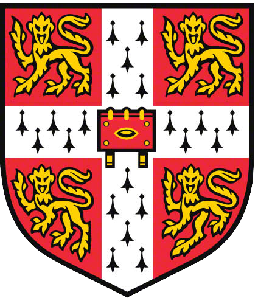
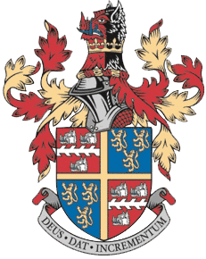

<h3>

University of Cambridge
  

    
Masters in Engineering

    
2016 - 2017

  

</h3>

- Information Engineering, Thesis: “Interactive Touchscreen Displays”
- Award: Magdalene College Prize for Engineering

---

<h3>

University of Cambridge
  

    
Batchelors in Engineering

    
2013 - 2016

  

</h3>

- Electrical and Information Engineering - Class 2:1
- Award: Singapore Institute of Technology Scholarship

---

<h3>

Tonbridge School
  

    
AS/A Level

    
2011-2013

  

</h3>

- Triple Mathematics(A\*A\*A*), Physics(A*), Chemistry (A)
- HMC scholarship of excellence (covering all the tuition fees)

